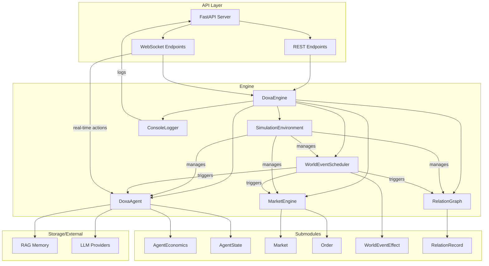
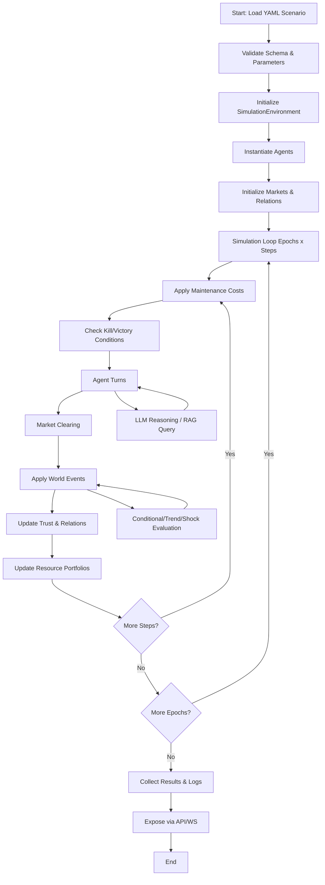

# Doxa: A Multi-Agent Simulation Platform for Economic and Social Dynamics

[Quick Start](QUICKSTART.md) | [Contributing](CONTRIBUTING.md) | [Code of Conduct](CODE_OF_CONDUCT.md) | [Paper](PAPER.md) | [YAML Reference](CONFIG_YAML_REFERENCE.md) | [Full Docs](https://vincenzomanto.github.io/Doxa)

Doxa is a YAML-driven multi-agent simulation platform for economic and social systems. It combines LLM-backed agents, market microstructure, relation graphs, and world events behind a FastAPI API and a React client.

[](https://github.com/VincenzoManto/Doxa/actions/workflows/ci.yml)
[](https://github.com/VincenzoManto/Doxa/actions/workflows/docs.yml)
[](https://pypi.org/project/doxa-ai/)
[](https://colab.research.google.com/github/VincenzoManto/Doxa/blob/main/notebooks/doxa.ipynb)
[](https://doi.org/10.5281/zenodo.19659521)

## Quick Start

1. Copy `.env.example` to `.env` and add your provider keys.
2. For local development:
  - Backend: `pip install -r server/requirements-dev.txt`
  - Frontend: `cd client && npm install`
3. Start with Docker: `docker compose up --build`
4. Open `http://localhost:3000`


Do you want to just run Doxa without installation? Here our [](https://colab.research.google.com/github/VincenzoManto/Doxa/blob/main/notebooks/doxa.ipynb) is the fastest way to get started.

See [QUICKSTART.md](QUICKSTART.md) for the full setup flow.

### Possible installation flows:

- Docker (backend + frontend) (`docker compose up --build`)
- Local dev (backend + frontend) 
- Backend only (via PyPI package and CLI) (`pip install doxa-ai`)

## Example Scenarios

- `scenarios/hormuz.yaml` — bilateral farmer-miner market with world shocks
- `scenarios/info-diffusion.yaml` — misinformation diffusion through a trust network
- `scenarios/financial-market.yaml` — multi-trader market microstructure scenario
- `scenarios/resource-scarcity.yaml` — cooperation versus conflict under water and food stress
- `scenarios/policy-stress.yaml` — central bank, banks, and firms under a liquidity shock
- `scenarios/ai-negotiation.yaml` — treaty negotiation and deterrence dynamics between states

## Abstract

Doxa is a modular, extensible platform for multi-agent simulation, integrating generative AI, economic modeling, and social dynamics. This whitepaper presents the motivation, formal architecture, YAML-based scenario schema, agent logic, engine internals, API, and a detailed case study, providing a reproducible foundation for research in computational economics and AI-driven agent systems.

## 1. Introduction and Motivation

Multi-agent systems (MAS) are fundamental for modeling complex phenomena in economics, social science, and artificial intelligence. However, most existing platforms lack a unified, declarative, and extensible approach to combine economic simulation, social relations, and modern AI-driven reasoning. Doxa addresses this gap by providing a rigorous, YAML-driven simulation engine with support for generative AI, market microstructure, and rich event dynamics.

## 2. Related Work

Agent-based modeling platforms such as NetLogo, MASON, and Repast have enabled decades of research, but typically lack native support for LLM-based reasoning and flexible market mechanisms. Recent frameworks (e.g., OpenAI Gym, PettingZoo) focus on RL environments but do not offer declarative scenario modeling or social/economic integration. Doxa uniquely combines:

- Declarative YAML scenario specification
- Generative AI integration (OpenAI, Google, Ollama, etc.)
- Economic/market simulation (OTC, LOB, market makers)
- Social trust and relation dynamics
- Extensible API for real-time and batch control

## 3. Formal System Architecture




Doxa is composed of the following core modules (see `server/engine/`):

- **DoxaEngine**: Orchestrates simulation, manages global state, and enforces rules.
- **SimulationEnvironment**: Loads configuration, tracks portfolios, agents, trades, and RAG memory.
- **DoxaAgent**: Implements agent logic, persona, constraints, and tool registration.
- **MarketEngine/Market**: Handles market clearing, order books, and price dynamics.
- **RelationGraph/RelationRecord**: Manages trust and social relations.
- **WorldEventScheduler/WorldEventEffect**: Triggers and applies world events.
- **ConsoleLogger**: Provides advanced logging for debugging and analysis.

The architecture is modular, with each subsystem responsible for a specific aspect: economics, market, relations, communication, resources, events, and API integration.

## 4. YAML Scenario Schema (Formal Specification)

The scenario YAML file is the single source of truth for simulation configuration. It is strictly validated and supports the following top-level fields:

- `global_rules`: Simulation-wide settings (timing, maintenance, kill/victory conditions, constraints, operations, markets, relations, dynamics).
- `actors`: List of agent types, each with identity, persona, initial portfolio, constraints, operations, trading mode, and economic parameters.
- `world_events`: Optional list of scheduled or conditional events that affect resources, markets, or trust.

See Section 8 for a concrete example (hormuz.yaml).

## 5. Subsystem Formalization



### 5.1 Economic Subsystem
Each agent $a$ is parameterized by a utility function $U_a$, risk aversion $\gamma_a$ (CRRA) or $\alpha_a$ (CARA), and discount factor $\beta_a$. The agent's decision process maximizes expected utility subject to resource constraints and market conditions. Liquidity preferences and price expectations are modeled as advisory or hard constraints.

### 5.2 Market Subsystem
Let $M = \{m_1, ..., m_k\}$ be the set of markets, each defined by a tuple $(resource, currency, price, bounds, clearing, maker)$. Orders are matched according to the clearing policy (per step, on order, call auction). Synthetic market makers post quotes with configurable spread $s$, depth $d$, and inventory skew $\kappa$.

### 5.3 Relations Subsystem
The trust graph $G = (V, E)$ is a directed, weighted graph where $E = \{(i, j, t_{ij})\}$ and $t_{ij} \in [0,1]$ is the trust from agent $i$ to $j$. Trust is updated by events and actions: $t_{ij}' = t_{ij} + \Delta t$ (with decay and contagion as specified in YAML).

### 5.4 Communication Subsystem
Agents exchange messages $m = (src, dst, type, payload)$ via private or public channels. Negotiation protocols (propose, accept, reject) are implemented as tools, and communication can trigger trust or event updates.

### 5.5 Resource Management
Let $R$ be the set of resources. Each agent maintains a portfolio $P_a: R \to \mathbb{R}_{\geq 0}$. Resource transfers are validated against global and local constraints, and all operations are atomic (rolled back on violation).

### 5.6 Events Subsystem
World events $E = \{e_1, ..., e_n\}$ are defined by triggers (tick, condition) and effects (resource, market, trust, contagion). The event scheduler applies effects according to the event type (shock, trend, conditional).

### 5.7 API and Integration
The API exposes endpoints for scenario management, simulation control, and data streaming. REST endpoints support batch operations; WebSocket endpoints provide real-time updates for agent actions and resources.

## 6. Validation and Properties

The engine enforces strict validation of scenario files (see CONFIG_YAML_REFERENCE.md):

- Uniqueness of agent IDs
- All referenced resources must be declared
- Market and operation parameters must be feasible
- Victory conditions must be reachable
- All constraints and event triggers are checked for logical consistency

The system is designed for reproducibility, extensibility, and modularity. All simulation runs are fully determined by the YAML and engine version.

## 7. Use Cases and Experimental Scenarios

Doxa supports a wide range of research applications, including:

- Economic market experiments (e.g., price discovery, liquidity shocks)
- Social contagion and trust dynamics
- AI-driven negotiation and coalition formation
- Policy evaluation and stress testing

## 8. Case Study: hormuz.yaml

See below for a concrete scenario (excerpt):

```yaml
global_rules:
  epochs: 1
  steps: 12
  execution_mode: sequential
  maintenance:
    corn: 2
  kill_conditions:
    - resource: corn
      threshold: 0
  victory_conditions:
    - resource: gold
      threshold: 34
  relation_dynamics:
    on_trade_success:
      trust_delta: 0.03
    on_trade_rejected:
      trust_delta: -0.02
    on_broadcast:
      trust_delta: 0.01
    trust_decay_rate: 0.01
    panic_decay_rate: 0.05
  relations:
    - source: player
      target: miners
      trust: 0.68
      type: neutral
    - source: miners
      target: player
      trust: 0.58
      type: neutral
  markets:
    - resource: gold
      currency: credits
      initial_price: 6.0
      min_price: 1.0
      max_price: 40.0
      clearing: per_step
    - resource: corn
      currency: credits
      initial_price: 2.4
      min_price: 0.5
      max_price: 15.0
      clearing: per_step
world_events:
  - name: gold_spike
    type: shock
    trigger:
      tick: 4
    effect:
      market: gold
      price_multiplier: 1.4
  - name: corn_shortage
    type: shock
    trigger:
      tick: 6
    effect:
      market: corn
      price_multiplier: 1.35
  - name: panic_wave
    type: trend
    trigger:
      tick: 2
    duration: 3
    effect:
      targets: all
      resource: panic
      rate: 0.08
  - name: food_relief
    type: conditional
    trigger:
      condition:
        resource: corn
        operator: lt
        threshold: 6
        scope: any_agent
    effect:
      targets: all
      resource: corn
      delta: 3
actors:
  - id: player
    provider: google
    model_name: gemini-2.5-pro
    persona: |
      Farmer-trader. Your core business is converting gold into corn. Keep enough corn to survive maintenance and monetize surplus.
    trading_mode: both
    initial_portfolio:
      credits: 45
      corn: 12
      gold: 5
      panic: 0.0
    constraints:
      gold:
        min: 0
      corn:
        min: 0
      credits:
        min: 0
      panic:
        min: 0
        max: 1
    operations:
      farm:
        input:
          gold: 1
        output:
          corn: 4
  - id: miners
    provider: google
    model_name: gemini-2.5-pro
    persona: |
      Miner-merchant. Your core business is converting corn into gold. Prefer the exchange over OTC: check the corn and gold books, post bids for corn before you run short, post asks for gold when inventory is ample, and use direct negotiation only when the book is empty or a bilateral trade is clearly better. Keep enough corn to continue mining.
    trading_mode: both
    initial_portfolio:
      credits: 55
      corn: 6
      gold: 16
      panic: 0.0
    constraints:
      gold:
        min: 0
      corn:
        min: 0
      credits:
        min: 0
      panic:
        min: 0
        max: 1
    operations:
      mine:
        input:
          corn: 2
        output:
          gold: 5
```

## 9. Discussion and Limitations

Doxa is designed for extensibility and reproducibility, but current limitations include scalability to very large agent populations, lack of native distributed execution, and reliance on external LLM APIs for advanced reasoning. Future work includes support for distributed simulation, richer agent cognition, and advanced visualization tools.

## 10. Conclusion

Doxa provides a robust, extensible platform for multi-agent simulation, integrating economic, social, and AI-driven reasoning. Its YAML-based configuration, modular engine, and API make it suitable for a wide range of research applications.

## References
% [1] Wilensky, U. (1999). NetLogo. http://ccl.northwestern.edu/netlogo/
% [2] Luke, S., et al. (2005). MASON: A Multiagent Simulation Environment. Simulation, 81(7), 517-527.
% [3] North, M.J., et al. (2013). Complex Adaptive Systems Modeling with Repast Simphony. Complex Adaptive Systems Modeling, 1(1), 3.
% [4] Brockman, G., et al. (2016). OpenAI Gym. arXiv preprint arXiv:1606.01540.
% [5] Terry, J.K., et al. (2020). PettingZoo: Multi-Agent Reinforcement Learning Environments. NeurIPS 2020.
