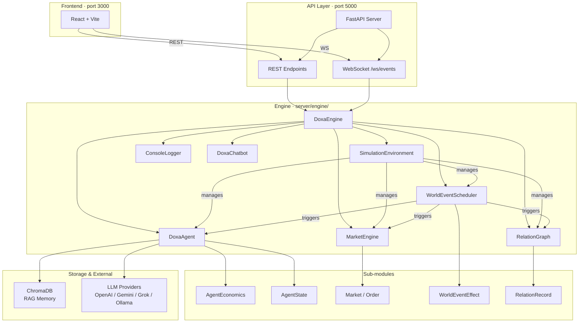
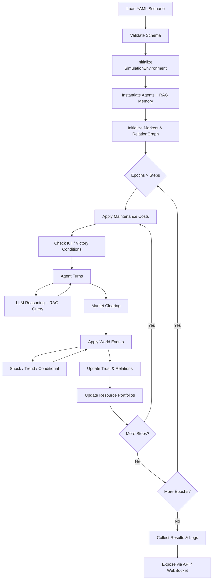

# Architecture

Doxa is composed of a **FastAPI backend** and a **React frontend**,
connected via REST and WebSocket. All simulation logic lives in `server/engine/`.

---

## System Overview



---

## Simulation Loop



---

## Module Responsibilities

| Module | Path | Responsibility |
|--------|------|----------------|
| **DoxaEngine** | `engine/DoxaEngine.py` | Top-level orchestrator. Owns all subsystems; validates config; drives the epoch/step loop. |
| **SimulationEnvironment** | `engine/SimulationEnvironment.py` | Tracks portfolios, pending trades, trade history, and RAG memory handles per agent. |
| **DoxaAgent** | `engine/agents/DoxaAgent.py` | Wraps AutoGen `ConversableAgent`. Registers tools, applies constraints, holds persona. |
| **AgentEconomics** | `engine/agents/AgentEconomics.py` | CRRA/CARA utility calculation, price-expectation EWA, liquidity-floor advisories. |
| **AgentState** | `engine/agents/AgentState.py` | Serialises agent state into the LLM context prompt. |
| **MarketEngine** | `engine/market/MarketEngine.py` | Manages all Market instances; routes orders; triggers clearing. |
| **Market** | `engine/market/Market.py` | Single LOB instrument: bid/ask book, FIFO matching, price history, market-maker quoting. |
| **Order** | `engine/market/Order.py` | Order dataclass (side, price, quantity, agent, status). |
| **RelationGraph** | `engine/relations/RelationGraph.py` | Directed weighted trust graph; updates, decay, reclassification, serialisation. |
| **RelationRecord** | `engine/relations/RelationRecord.py` | Single directed edge with trust score and label. |
| **WorldEventScheduler** | `engine/events/WorldEventScheduler.py` | Evaluates triggers each tick; dispatches effects via `WorldEventEffect`. |
| **WorldEventEffect** | `engine/events/WorldEventEffect.py` | Applies shock / trend / conditional effects to markets, portfolios, and trust. |
| **MacroTracker** | `engine/MacroTracker.py` | Computes Gini, HHI, price volatility, system panic; maintains history buffer. |
| **DoxaChatbot** | `engine/DoxaChatbot.py` | RAG-based Q&A assistant that queries the simulation's ChromaDB collections. |
| **ConsoleLogger** | `engine/utils/ConsoleLogger.py` | Structured in-process event bus; feeds the WebSocket event queue. |

---

## Data Flows

### Agent Decision Cycle

```
DoxaEngine.step()
  └─ DoxaAgent.run_turn()
       ├─ AgentState.build_prompt() → portfolio, prices, relations, tick
       ├─ LLM call (AutoGen)        → tool calls selected by the LLM
       └─ ToolDispatch
            ├─ place_buy_order / place_sell_order → MarketEngine
            ├─ make_trade_offer / accept / reject  → SimulationEnvironment
            ├─ operate (farm, mine …)              → SimulationEnvironment
            ├─ send_message / broadcast            → RelationGraph
            ├─ save_knowledge / query_knowledge    → ChromaDB
            └─ think / report                      → ConsoleLogger
```

### World Event Cascade

```
WorldEventScheduler.tick()
  └─ for each event:
       ├─ shock     → immediate one-time effect (price × multiplier, portfolio ± delta)
       ├─ trend     → repeated delta for N ticks
       └─ conditional → evaluates predicate; fires once when true
            └─ WorldEventEffect.apply()
                 ├─ market  → MarketEngine.set_price()
                 ├─ resource → SimulationEnvironment.portfolios[targets]
                 └─ trust    → RelationGraph.update()
```

---

## Directory Layout

```
server/
├── api.py                  FastAPI application + all endpoints
└── engine/
    ├── DoxaEngine.py       Orchestrator (≈1 200 lines)
    ├── SimulationEnvironment.py
    ├── MacroTracker.py
    ├── DoxaChatbot.py
    ├── agents/
    │   ├── DoxaAgent.py
    │   ├── AgentEconomics.py
    │   └── AgentState.py
    ├── market/
    │   ├── Market.py
    │   ├── MarketEngine.py
    │   └── Order.py
    ├── relations/
    │   ├── RelationGraph.py
    │   └── RelationRecord.py
    ├── events/
    │   ├── WorldEventScheduler.py
    │   └── WorldEventEffect.py
    └── utils/
        └── ConsoleLogger.py

client/
├── src/
│   ├── App.tsx
│   ├── api.ts              REST + WebSocket client helpers
│   ├── EventContext.tsx     Global event stream context
│   └── components/         Panel components
└── vite.config.ts
```
